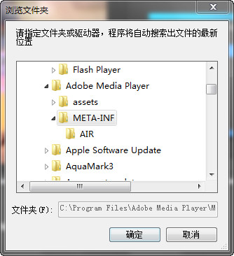



## SHBrowseForFolder Unicode & FullPath in EditBox  \-Windows 7 Style 

### Description

It's very easy to find a SHBrowseForFolder code. But they didn't support unicode. They can not show full path in the edit box. They'are outdate for example using lcrat to return an invalid pointer. And sometimes you just want to search so will need to disable the edit box. This code will help you a lot. The disabled box is 100ï¼… the same to Windows 7 by using internal messages.
 
### More Info
 

             |
---                |---
**Submitted On**   |2011-05-16 17:16:44
**By**             |[Ryan Wei](https://github.com/Planet-Source-Code/PSCIndex/blob/master/ByAuthor/ryan-wei.md)
**Level**          |Intermediate
**User Rating**    |5.0 (20 globes from 4 users)
**Compatibility**  |VB 6\.0
**Category**       |[Windows API Call/ Explanation](https://github.com/Planet-Source-Code/PSCIndex/blob/master/ByCategory/windows-api-call-explanation__1-39.md)
**World**          |[Visual Basic](https://github.com/Planet-Source-Code/PSCIndex/blob/master/ByWorld/visual-basic.md)
**Archive File**   |[SHBrowseFo2204375172011\.zip](https://github.com/Planet-Source-Code/ryan-wei-shbrowseforfolder-unicode-fullpath-in-editbox-windows-7-style__1-73909/archive/master.zip)

